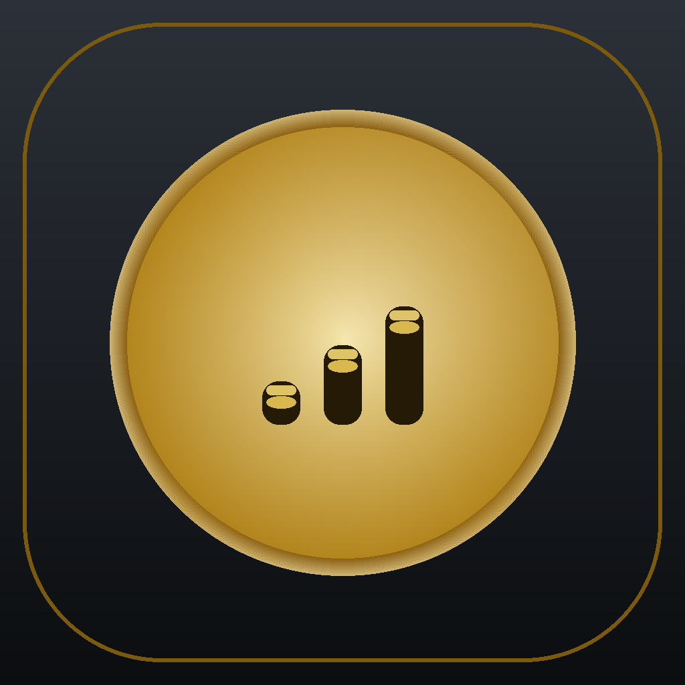

<p align="center">
  
</p>

<h1 align="center">Money Tracker</h1>

<p align="center">
  <strong>A personal finance app for Algeria</strong> — track your income and expenses in Algerian Dinars (DA), plan budgets, save toward goals, and understand your money at a glance.
</p>

<p align="center">
  
  
  
  
</p>

---

## About

Money Tracker is a fully offline, local-first budget app designed around how money actually works here in Algeria: cash-heavy spending, living expenses, salaries, and savings — all in **DA**.

Everything is stored **locally on your device** (SQLite). No accounts, no cloud, no ads, no tracking.

Its signature **Dark + Gold luxury** design is calm and premium without being flashy — with charts, dashboards, and statistics that help you see where your money goes, not just how much you have.

## Features

- **Balanced dashboard** — current balance, today's / this week's / this month's spending, income vs expenses, and committed monthly bills at a glance.
- **Transactions** — add, edit, duplicate and delete incomes & expenses, quick-add sheet, category picker, and a full search.
- **Calendar view** — see your spending per day and jump to any month.
- **Statistics & insights** — monthly stats, category breakdown (donut), daily trend bars, income/expense trend lines, and automatically generated money tips.
- **Budgets** — set monthly limits per category with live progress bars and overspend warnings.
- **Savings goals** — track progress toward targets (with optional target dates).
- **Recurring transactions** — daily / weekly / monthly / yearly recurring incomes & expenses with one tap to add.
- **Excel export** — export all your data to a clean `.xlsx` (transactions + summary sheets) and share it.
- **Backup & restore** — full device backup and restore of your entire data.
- **Security** — optional 4-digit PIN, biometric unlock (fingerprint / face) and auto-lock.
- **Daily reminders** — optional morning / midday / evening notification reminders.
- **Trilingual & RTL** — English, French and Arabic with full right-to-left layout support.
- **Dark + Gold luxury theme** — a hand-built Material 3 design with light & dark modes (system / light / dark) and properly adapting semantic colors.

## Tech stack

| Layer | Choice |
| --- | --- |
| Framework | Flutter (Material 3) |
| State management | Provider + ChangeNotifier |
| Local database | SQLite (`sqflite`) |
| Persistence | `shared_preferences` |
| Charts | `fl_chart` |
| Excel export | `excel` + `archive` |
| Security | `local_auth`, custom PIN (SHA-256) |
| Notifications | `flutter_local_notifications` |

## Getting started

Prerequisites: [Flutter SDK](https://docs.flutter.dev/get-started/install) 3.29+ with an Android toolchain.

```bash
# clone
git clone https://github.com/MoIslam-Dev/money_tracker.git
cd money_tracker

# fetch dependencies
flutter pub get

# run the app
flutter run

# run the test suite (81 tests: unit, integration & contrast/theme)
flutter test
```

### Build a release APK

```bash
flutter build apk --release
# output: build/app/outputs/flutter-apk/app-release.apk
```

## Project structure

```
lib/
├── main.dart              # app entry, MaterialApp + theme mode wiring
├── theme/                 # luxury Dark+Gold themes, LuxColors extension
├── screens/               # dashboard, calendar, stats, budgets, savings, ...
├── widgets/               # shared UI: charts, money text, buttons, etc.
├── state/                 # AppState (ChangeNotifier) + settings store
├── data/                  # SQLite repository + database schema
├── models/                # domain models
├── l10n/                  # EN / FR / AR strings + RTL helpers
├── utils/                 # money formatting, hashing, date helpers
└── services/              # notifications, excel export, backup
```

## Design notes

The visual identity is a hand-crafted **Dark + Gold** system rather than a Material color-scheme generator output:

- Deep charcoal surfaces (`#0B0D10`) with warm cream text for a calm, premium reading experience.
- Signature gold (`#D4AF37`) used as the primary accent — buttons, selected segments, navigation, charts.
- Semantic colors are resolved at paint time through a `LuxColors` `ThemeExtension`, so rapid light/dark switching can never leave stale colors behind (covered by regression tests).

## Testing

The suite covers app boot, navigation, theme contrast (WCAG AA), light/dark switching, analytics, budgets/goals/recurring logic, and Excel export integrity.

```bash
flutter analyze   # static analysis, zero issues expected
flutter test      # 81 tests
```

## Contributing

This is a personal project, but issues, suggestions and pull requests are welcome. Keep changes focused, follow the existing style, and make sure `flutter analyze` and `flutter test` pass.

## Disclaimer

This app stores all data locally on your device. Export or backup regularly if you change or uninstall the app.